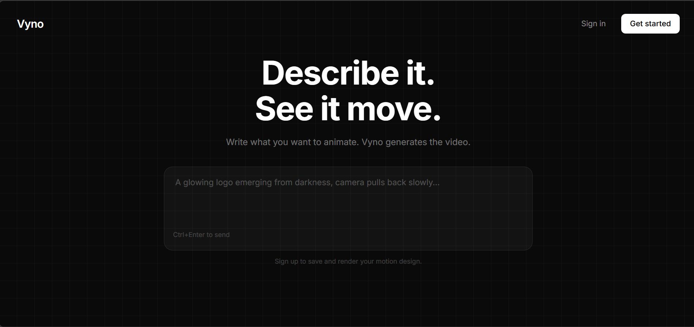
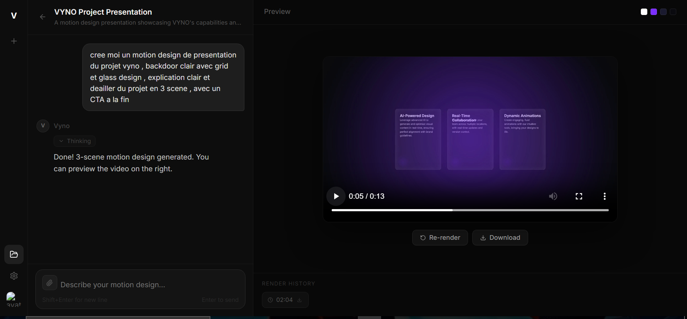
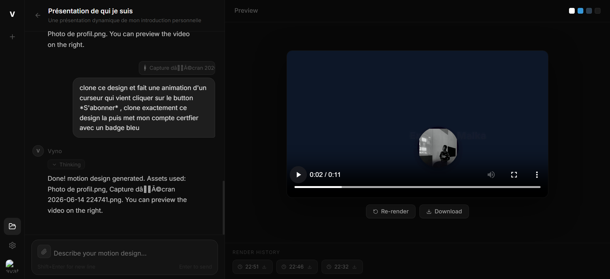

<div align="center">



<br/>

# Vyno AI - Motion Design Generator Tools

**An AI agent that turns text descriptions into rendered motion design videos.**

[](https://nodejs.org/)
[](https://react.dev/)
[](https://hyperframes.dev/)
[](https://developers.cloudflare.com/workers-ai/)
[](LICENSE)
[]()


</div>

---

## What is Vyno?

**Vyno** is an open-source AI agent designed for **automated motion design generation**. You describe what you want — a product intro, a brand reveal, a personal presentation — and Vyno writes the code, renders the frames, and delivers a `.mp4` video.

Under the hood, Vyno combines three technologies:

- **LLM (Cloudflare AI / any provider)** — interprets your prompt, plans the storyboard and visual identity, then generates HTML/CSS/JS animations for each scene individually
- **HyperFrames** — a headless browser-based video composition engine that renders HTML/CSS/GSAP animations frame-by-frame into a video
- **FFmpeg** — encodes the rendered frames into a final `.mp4` file

Vyno uses a **two-phase generation pipeline**: the LLM first produces a lightweight plan (storyboard + color palette), then generates each scene file in a dedicated request — ensuring high-quality, complete code output even for complex multi-scene compositions.

---

## Screenshots

<div align="center">


<sub>Vyno generating a 3-scene motion design from a single text prompt</sub>

<br/><br/>


<sub>Asset-aware generation: Vyno analyzes uploaded images with vision AI and integrates them into the animation</sub>

</div>

---

## How It Works

```
User prompt
    │
    ▼
┌─────────────┐    Phase 1     ┌──────────────────────────┐
│             │ ─────────────► │  LLM (PLAN_PROMPT)       │
│   Backend   │                │  → storyboard JSON       │
│  (Node.js)  │ ◄───────────── │  → visual_identity       │
│             │                └──────────────────────────┘
│             │
│             │    Phase 2     ┌──────────────────────────┐
│             │ ─────────────► │  LLM (SCENE_PROMPT)      │
│             │  (1 call/file) │  → raw HTML per scene    │
│             │ ◄───────────── │  (index + compositions)  │
│             │                └──────────────────────────┘
│             │
│             │    Render      ┌──────────────────────────┐
│             │ ─────────────► │  HyperFrames             │
│             │                │  Puppeteer → frames      │
│             │ ◄───────────── │  FFmpeg → output.mp4     │
└─────────────┘                └──────────────────────────┘
```

Each generated video is a **multi-file HyperFrames project**:
- `index.html` — root orchestrator with scene layout and GSAP timeline
- `compositions/scene1.html` — sub-composition with scoped CSS + GSAP animations
- `compositions/scene2.html` — ...
- `assets/` — uploaded images, logos, screenshots

---

## Current Capabilities & Limitations

### ✅ What Vyno can do today

- Generate multi-scene motion design videos from a text prompt
- Accept uploaded assets (logo, photo, UI screenshot) — analyzed with vision AI
- Stream task progress in real-time via SSE
- Re-render or iterate on existing projects with new prompts
- Download final `.mp4` output directly from the UI
- Render history per project

### ⚠️ Current Limitations

- Render quality depends heavily on the LLM model used (see [Changing the Model](#changing-the-model))
- No audio support yet
- No camera motion or 3D effects
- Complex multi-element layouts may require manual HTML tweaking

### 🔮 Upcoming Features

We are planning to extend Vyno with **MCP (Model Context Protocol) tool integrations** to give the AI access to external creative resources:

- 🎵 **Audio** — background music, sound effects, beat-synced animations
- 🖼️ **Stock images / illustrations** — via external APIs
- 🎬 **Video clips** — embed footage inside compositions
- 🔤 **Font libraries** — dynamic font selection
- 🎨 **Design system APIs** — brand kit integration

---

## Prerequisites

| Requirement | Version | Notes |
|---|---|---|
| [Node.js](https://nodejs.org/) | 22+ | Backend + frontend |
| [MySQL](https://www.mysql.com/) | 8+ | via XAMPP or standalone |
| [FFmpeg](https://ffmpeg.org/) | 6+ | Video encoding |
| [HyperFrames](https://hyperframes.dev/) | latest | `npm i -g hyperframes` |
| Cloudflare AI account | — | Free tier available |
| Google Gemini API key | — | Optional (vision analysis fallback to Cloudflare) |

---

## Installation

### 1. Clone the repository

```bash
git clone https://github.com/Onestepcom00/vyno-ai.git
cd vyno
```

### 2. Install FFmpeg

Download a pre-built binary from [ffmpeg.org/download](https://ffmpeg.org/download.html) and note the absolute path to `ffmpeg.exe` (Windows) or `ffmpeg` (Linux/macOS).

### 3. Install HyperFrames

```bash
npm install -g hyperframes
```

### 4. Set up the database

Start MySQL (via XAMPP or any MySQL server), then create the database:

```sql
CREATE DATABASE vyno CHARACTER SET utf8mb4 COLLATE utf8mb4_unicode_ci;
```

or you can use backend/src/db/vyno.sql

### 5. Configure the backend

```bash
cd backend
cp .env.example .env
```

Edit `backend/.env`:

```env
PORT=3001
JWT_SECRET=change_this_to_a_random_secret_string

# MySQL
DB_HOST=localhost
DB_PORT=3306
DB_NAME=vyno
DB_USER=root
DB_PASSWORD=

# Cloudflare AI
CF_ACCOUNT_ID=your_cloudflare_account_id
CF_AI_TOKEN=your_cloudflare_ai_token
CF_AI_MODEL=@cf/deepseek-ai/deepseek-r1-distill-qwen-32b

# FFmpeg — MUST be an absolute path
FFMPEG_PATH=C:/path/to/ffmpeg.exe

# HyperFrames project storage
PROJECTS_BASE_PATH=./projects

# Optional: Google Gemini for image analysis (recommended)
GEMINI_API_KEY=your_gemini_api_key
```

### 6. Install dependencies & start

**Backend:**
```bash
cd backend
npm install
npm run dev
```
→ Runs on `http://localhost:3001`

**Frontend** (new terminal):
```bash
cd frontend
npm install
npm run dev
```
→ Runs on `http://localhost:5173`

Open `http://localhost:5173`, create an account, and start generating.

---

## Project Structure

```
vyno/
├── backend/
│   ├── src/
│   │   ├── db/
│   │   │   └── connection.js       # MySQL connection + auto-schema
│   │   ├── middleware/
│   │   │   └── auth.js             # JWT authentication
│   │   ├── routes/
│   │   │   ├── chat.js             # Main generation pipeline (SSE)
│   │   │   ├── projects.js         # Project CRUD + video streaming
│   │   │   └── user.js             # Auth routes
│   │   ├── services/
│   │   │   ├── llm.js              # Cloudflare AI client
│   │   │   ├── systemPrompt.js     # PLAN_PROMPT + SCENE_PROMPT
│   │   │   ├── executor.js         # Task runner (write_file, render, etc.)
│   │   │   └── vision.js           # Image analysis (Gemini / Cloudflare)
│   │   └── index.js
│   ├── projects/                   # Auto-generated HyperFrames projects
│   └── .env
└── frontend/
    └── src/
        ├── components/             # ChatPanel, VideoPlayer, TaskList, etc.
        ├── pages/                  # Landing, Auth, Dashboard, ProjectPage
        ├── services/               # API client (REST + SSE)
        ├── store/                  # Zustand (auth, project state)
        └── styles/
```

---

## Changing the Model

> **The render quality depends heavily on the LLM model you use.**  
> A more capable reasoning model = better HTML code = better video.

Vyno uses **Cloudflare Workers AI** by default, but you can switch to any LLM provider.

### Option A — Switch Cloudflare model

In `backend/.env`, change `CF_AI_MODEL` to any model available on your Cloudflare account:

```env
# Recommended reasoning models (better code generation):
CF_AI_MODEL=@cf/deepseek-ai/deepseek-r1-distill-qwen-32b
CF_AI_MODEL=@cf/meta/llama-3.3-70b-instruct-fp8-fast
CF_AI_MODEL=@cf/qwen/qwen2.5-coder-32b-instruct
```

Browse all available models at [developers.cloudflare.com/workers-ai/models](https://developers.cloudflare.com/workers-ai/models/).

### Option B — Switch to a different provider (OpenAI, Anthropic, Groq, Ollama...)

Edit `backend/src/services/llm.js`. The `callLLM` function is the single integration point:

```js
// Current: Cloudflare AI
const response = await fetch(CF_API_URL, {
  method: 'POST',
  headers: { Authorization: `Bearer ${CF_TOKEN}`, 'Content-Type': 'application/json' },
  body: JSON.stringify({ messages, max_tokens: 16000 }),
});
```

**Example — switch to OpenAI:**

```js
import OpenAI from 'openai';
const client = new OpenAI({ apiKey: process.env.OPENAI_API_KEY });

export async function callLLM(messages, history = []) {
  const trimmedHistory = history.slice(-6);
  const allMessages = [...messages.slice(0,1), ...trimmedHistory, ...messages.slice(1)];

  const completion = await client.chat.completions.create({
    model: 'gpt-4o',          // or o1, gpt-4-turbo, etc.
    messages: allMessages,
    max_tokens: 16000,
  });

  const raw = completion.choices[0].message.content || '';
  return { ...parseLLMResponse(raw), raw };
}
```

**Example — switch to Anthropic Claude:**

```js
import Anthropic from '@anthropic-ai/sdk';
const client = new Anthropic({ apiKey: process.env.ANTHROPIC_API_KEY });

export async function callLLM(messages, history = []) {
  const system = messages.find(m => m.role === 'system')?.content || '';
  const nonSystem = [...history.slice(-6), ...messages.filter(m => m.role !== 'system')];

  const msg = await client.messages.create({
    model: 'claude-opus-4-5',
    max_tokens: 16000,
    system,
    messages: nonSystem,
  });

  const raw = msg.content[0].text || '';
  return { ...parseLLMResponse(raw), raw };
}
```

> **Tip:** Models with strong reasoning and code generation capabilities produce significantly better results. `deepseek-r1`, `claude-opus`, and `gpt-4o` are recommended.

---

## Environment Variables Reference

| Variable | Required | Description |
|---|---|---|
| `PORT` | No | Backend port (default: `3001`) |
| `JWT_SECRET` | **Yes** | Secret for JWT signing — change before deploying |
| `DB_HOST` | **Yes** | MySQL host (usually `localhost`) |
| `DB_PORT` | No | MySQL port (default: `3306`) |
| `DB_NAME` | **Yes** | Database name (e.g. `vyno`) |
| `DB_USER` | **Yes** | MySQL user |
| `DB_PASSWORD` | No | MySQL password |
| `CF_ACCOUNT_ID` | **Yes** | Cloudflare account ID |
| `CF_AI_TOKEN` | **Yes** | Cloudflare AI API token |
| `CF_AI_MODEL` | **Yes** | Cloudflare AI model path |
| `FFMPEG_PATH` | **Yes** | **Absolute path** to `ffmpeg` binary |
| `PROJECTS_BASE_PATH` | No | Where projects are stored (default: `./projects`) |
| `GEMINI_API_KEY` | No | Google Gemini key for image analysis (recommended) |

---

## Contributing & Bug Reports

Vyno is **actively in development**. You may encounter bugs, incomplete features, or security issues.

If you find a bug or a security vulnerability, **please do not hesitate to open an issue** or contact directly:

- 🐛 **Bug reports:** [Open an issue](https://github.com/Onestepcom00/vyno-ai/issues)
- 🔒 **Security vulnerabilities:** Please report privately via email or GitHub private disclosure

All contributions (bug fixes, features, documentation, model integrations) are welcome. Fork the repo and open a pull request.

---

## Support the Project

Vyno is a free, open-source project built independently. If you find it useful and want to encourage its development:

**[☕ Support Vyno via donation](https://onemarket.mychariow.shop/donation-projects)**

Every contribution helps dedicate more time to features like MCP tool integrations, audio support, and model improvements.

---

## License

MIT — see [LICENSE](LICENSE) for details.

---

<div align="center">
  <sub>Built with HyperFrames · Cloudflare AI · GSAP · React · Node.js</sub>
</div>
